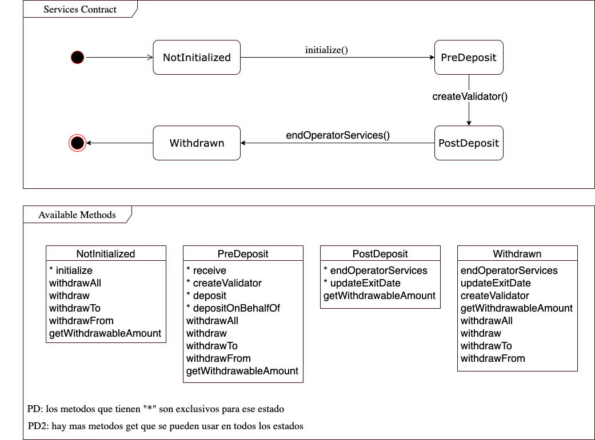

# Sensei Stake ETH 2.0

## Useful commands 

```shell
npx hardhat compile
npx hardhat test
npx hardhat run scripts/deploy-factory.js --network goerli
npx hardhat run scripts/deploy-service-contract.js --network goerli
```

---

## Step By Step Deploy

- `npx hardhat compile`
- `cp .env.default .env` and update its values
- `npx hardhat run scripts/deploy-factory.js --network goerli`

This gives us the factory and the service impl addresses and we have to modify in the senseistake-services-contract.mjs in lines 25 and 26.

- `npx hardhat run scripts/deploy-service-contract.js --network goerli`

---

## Executing steps

We can use some tools to execute them like remix([https://remix.ethereum.org/](https://remix.ethereum.org/)), truffle, hardhat, etc. 

### Step 1 fund the service contract

Call the following method with msg.value, salt and force params
```
msg.value : more than 0.1 eth

salt : the one we got in the second deploy (Salt bytes:  2c0a756f47cf4394657373ec2ffe52fe841c4b4dcab7c93394ed7240498b3da3)

force : false (if you set as true you can send less than 0.1 eth)
```
StakefishServicesContractFactory.sol —> fundMultipleContracts

### Step 2 create validator

This execution must be done by operator address.

Call the following method to create the validator with parameters from `deploy-service-contract.js` output:

```jsx
Method : 
StakefishServicesContract —> createValidator(
bytes calldata validatorPubKey,
bytes calldata depositSignature,
bytes32 depositDataRoot,
uint64 exitDate); 
```

This creates a validator sending all the total supply to the ETH deposit contract. 

The service contract will have no eth after run it and keep it in the deposit address.

--- 

## Notes

### Goerli **DepositContract** address

``0xff50ed3d0ec03aC01D4C79aAd74928BFF48a7b2b``

## How does it work?

- The contract starts in a ``NotInitialized`` state in the services contract constructor. After this it transitions to a ``PreDeposit`` state when the ``initialize`` method is called. In this state (only in this state) deposits are allowed from anywhere (up to a 32 ETH maximum).
- Once the 32 ETH required for the validator to be deployed are fulfilled, the function ``createValidator`` can be called. This function is going to use all the 32 ETH (in the smart contract) to fund the validator. This function can only be executed by the operator (the smart contract deployer, or the address that was assigned if the function ``changeOperatorAddress`` was called).
- Once the function ``createValidator`` is called, the smart contracts transitions to the state ``PreDeposit``. In this state no withdrawals can be made.
- Once the validator is decided to be stopped, the deposit is able to be withdrawn (we'll need to see how things are handled after the merge). After this, the validator funds go to the services smart contract address. Then the function ``endOperatorServices`` can be called, which triggers a change of state in the smart contract, from ``PostDeposit`` to ``Withdrawn``. Only in this state, clients (and the operator) are able to withdraw their initial investments (and/or revenues).
- Clients are the ones that are able to use the ``withdraw`` or ``withdrawAll`` to withdraw their deposit. What they can withdraw are their initial deposit plus earnings minus operator fees.
- If the operator wants to withdraw its earnings (collected fees of clients), it can do it calling the function ``operatorClaim``.


