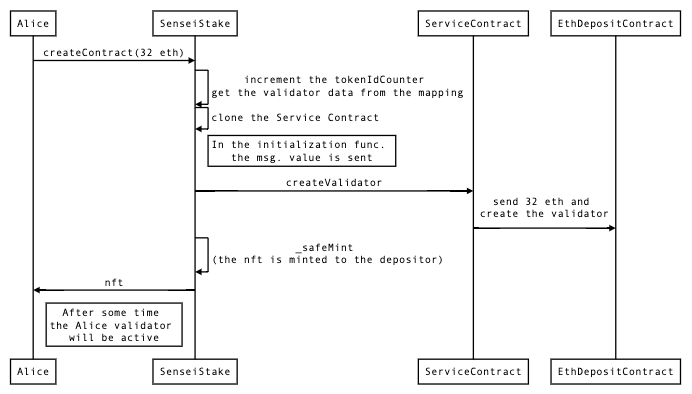
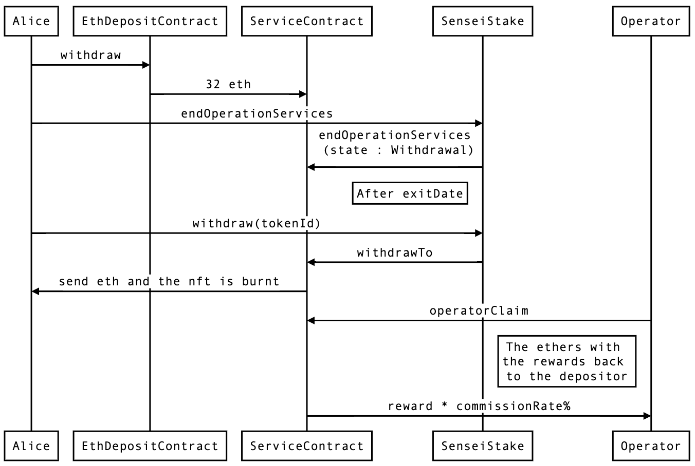
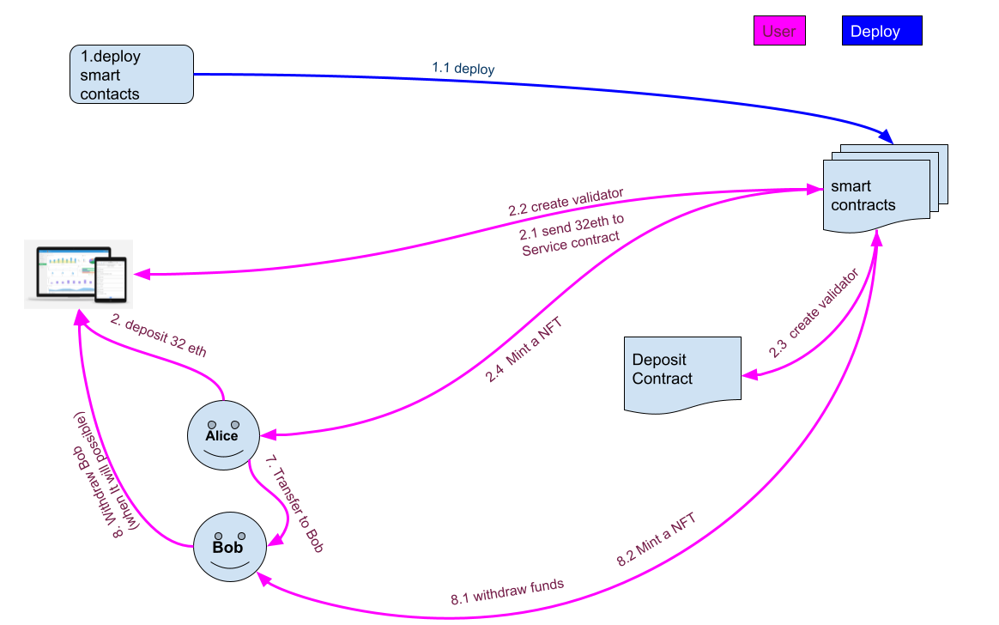

# Sensei Stake ETH 2.0

## Description 

This project is a non-custodial staking platform to Ethereum 2. When you create a validator you receive a NFT refering to your new validator. 

## Technical Description

To create a service contract we do it with [Clone proxy](#clone)<sup>1</sup>. To do it we need a salt (a unique identifier) and the contract implementation. We use a numeric sequence as the salt and use it as the nft tokenId. 
The process of the create a validator we do it in a just simple function call createContract with no paramter, just the msg.value with 32 ethers.
The create validator process is made with this call. This call group several actions like receive your deposit, send it to the eth deposit contract and mint your nft.

<sup>1</sup><a name="clone"></a><sub>The Clones library provides a way to deploy minimal non-upgradeable proxies for cheap. This can be useful for applications that require deploying many instances of the same contract (for example one per user, or one per task). These instances are designed to be both cheap to deploy, and cheap to call.</sub>

## Useful commands 

```shell
npx hardhat compile (the compile run in all the other calls before test or deploy)
npx hardhat test
npx hardhat deploy --network goerli 

you can use tags to deploy diferent part of the deploy --tags XXX 
```

---
## Deployment 

[go to deployment](deployment.md)

--- 

## Notes

### Goerli **DepositContract** address

``0xff50ed3d0ec03aC01D4C79aAd74928BFF48a7b2b``

### Mainnet **DepositContract** address

``0x00000000219ab540356cBB839Cbe05303d7705Fa``

## How does it work?
- The process starts with a user that call to SenseiStake-->createContract with 32 eth.  
- This process : 
  - clones the Service contract, 
  - send the ether to the desposit contract, 
  - create validator  
  - mint the nft
- After this process the state is setted to PostDeposit. 
- So far the user is an active validator. 
- At this moment the user has to wait to withdraw to 
- Once the validator is decided to be stopped , the deposit is able to be withdrawn (we'll need to see how things are handled after the merge). After this, the validator funds go to the services smart contract address. Then the function ``endOperatorServices`` can be called, which triggers a change of state in the smart contract, from ``PostDeposit`` to ``Withdrawn``. Only in this state, clients (and the operator) are able to withdraw their initial investments (and/or revenues) (this must be done by operator or the depositor after exit date).
- Clients are the ones that are able to use the ``withdraw`` or ``withdrawAll`` to withdraw their deposit. What they can withdraw are their initial deposit plus earnings minus operator fees.
- If the operator wants to withdraw its earnings (collected fees of clients), it can do it calling the function ``operatorClaim``.

## Sequence diagrams 

### Create Validator




### Withdraw from validator (after the merge allows it)




## Complete diagram of all process



# Sensei Stake V2

## general

This new version add the functionality related to the withdrawals. This allows user to withdraw his stake. If the user has a withdrawal credentials with 0x01 could withdraw his staked + rewards. 
We make a new version to allow this new functionality. 

### nft owner users

For the existing users, they have to send the token to the new contract in order to be updated to the new version. The new version prepares all the necessary to give the user a new nft in the new versión. 
<b>This process must be done after 6 month from the nft minting.</b> 

The internal process is the following : 
1. The user send the nft to the SenseiStakeV2 contract. 
2. The SenseiStakeV2 receive the nft. 
3. Check the date is after the exitDate from the service contract v1
4. Call the endOperatorServices in Sensei Stake V1 --> Service Contract V1. 
     - Make the followings checks: 
       - Check the balance of Service contract V1
       - Validator is active
       - now < exitDate
       - check msg.sender is the contractAddress or the onwer of the token
     - The validatorActive in the v1 contract is set to false
     - Calculate the operatorClaimable
5. Call the SenseiStakeV1.withdraw 
     - burn the NFT token in the V1
6. Call the withdrawTo in the ServiceContractV1
     - Checks: msg.sender == SenseiStakeV1 and Validator is active
     - Send the (address(this).balance - operatorClaimable) amount to the SenseiStakeV2
7. Calculate the rewards and send to the user. 
8. Mint new validator in the SenseiStakeV2 contract on behalf of user. The user is the owner of the new nft. 


## new user 

For the new user, they have to mint the nft in SenseiStakeV2 with 32 eth. The process is the same as the SenseiStakeV1. 

