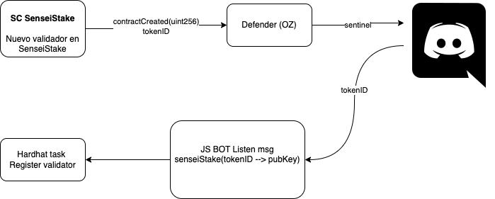

# SenseiStake + SSV Architecture

# Technologies used

## OpenZeppelin Defender: Sentinel

We use Sentinel for monitoring an event in the SenseiStake smart contract. The `ContractCreated(uint256 tokenIdServiceContract)` event. When this event gets triggered it means a new validator was funded. This event triggers a POST request to a discord webhook

## Discord: Webhook and Bot

- Webhook: there is a webhook on a dedicated read-only discord channel. The message contains the tokenId of the newly minted NFT (which means there was a new validator funded)
- Bot: there is also a discord bot listening for these messages. After detecting a new one, it gets its validator public key using the `tokenId` in the `SenseiStake` smart contract. The bot then dispatches the validator registration process.

## SSV Network: Smart Contracts and Libraries

- We use the SSV token contract to manage the allowances of SSV tokens, that need to be set in order to fund the validator manager account
- We use the SSV network contract in order to manage the validator registration (`registerValidator()` function)
- We use the `ssv-keys` library in order to generate the payload for the `registerValidator()` function

## SenseiStake: Smart Contracts

We use our smart contracts for funding and managing the ethereum validators. The smart contract also mints a new NFT every time there is a new validator funded

# Process of registering a new validator

1. The process begins in the `SenseiStake` smart contract (or dashboard). When a user calls the function `createContract()`. This function call triggers an event called `ContractCreated(uint256)`.
2. After the `ContractCreated(uint256)` event gets triggered, the Sentinel calls the defined discord webhook.
3. When the new message arrives on the discord channel associated to the webhook, the bot detects it and starts the SSV validator registration.

# How to run

You need to have a few things set up first:

1. This is all run using SenseiStake hardhat project. So the environment variables and files need to run this project are the first requirement
2. The keystore of the validator public key you want to register into the network needs to be placed somewhere inside a directory called keystores (on the root directory of the project). The file name should be properly formatted (IE. `keystore-m_12381_3600_*.json`)
3. Dependencies for SSV network includes: `operators.json` file (the one included into the project could be used if desired) and the token and network smart contract ABIs.
4. Finally for the discord bot to work, the bot secret needs to be included into an ENV variable called `DISCORD_BOT`

In order to execute the bot you need to run: `npx hardhat run --network goerli ./scripts/ssv-scripts/discord-bot.js`.
This only works for goerli at the time of writing this guide.

# Side notes

This whole architecture could have been avoided if the SSV network didn't consume SSV tokens when a validator is not active (currently attesting). 

Since right after a validator gets registered into the SSV network it starts consuming SSV tokens, we needed to come up with a way of determining the moment when a validator gets funded so that we only register it at that time.
